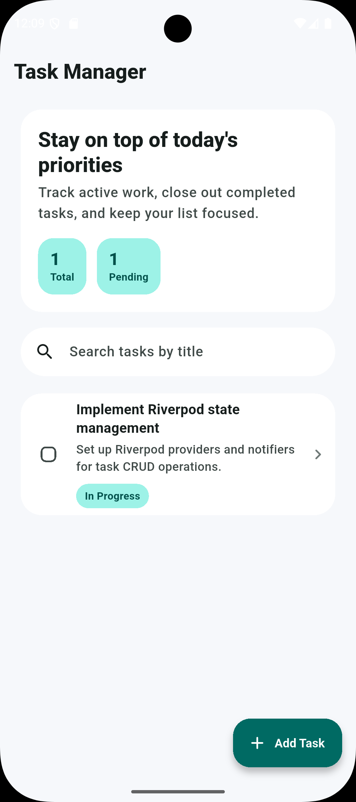
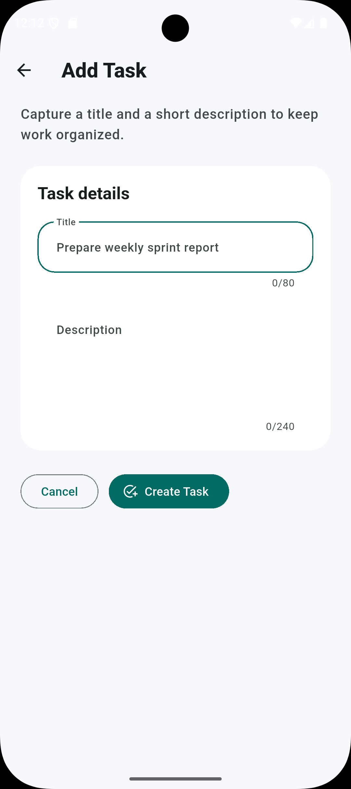
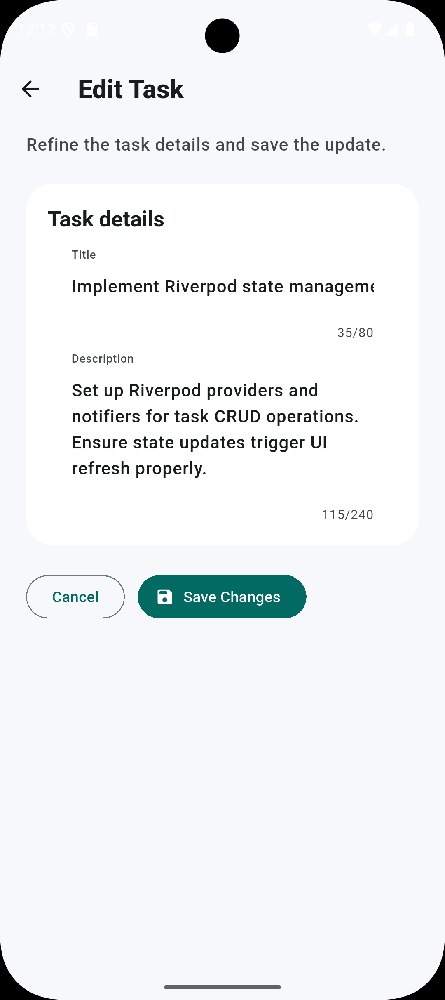
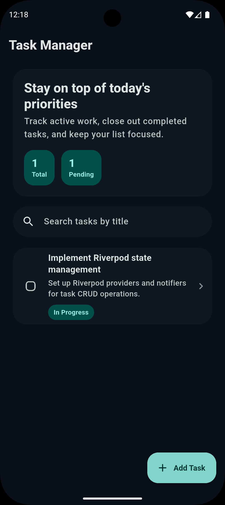
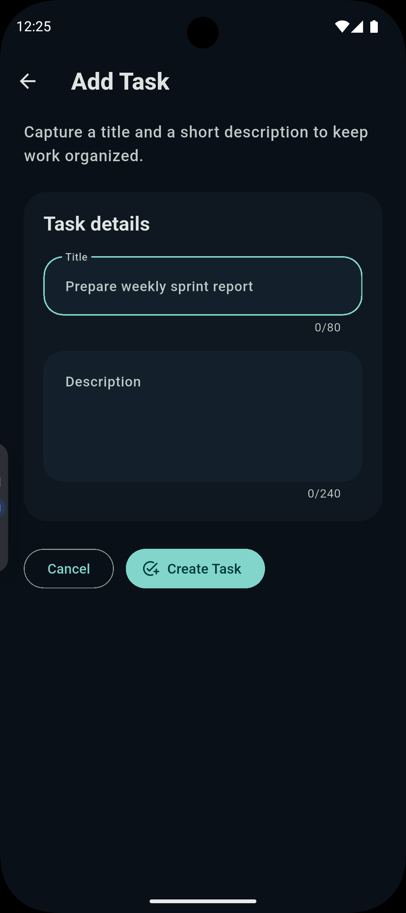
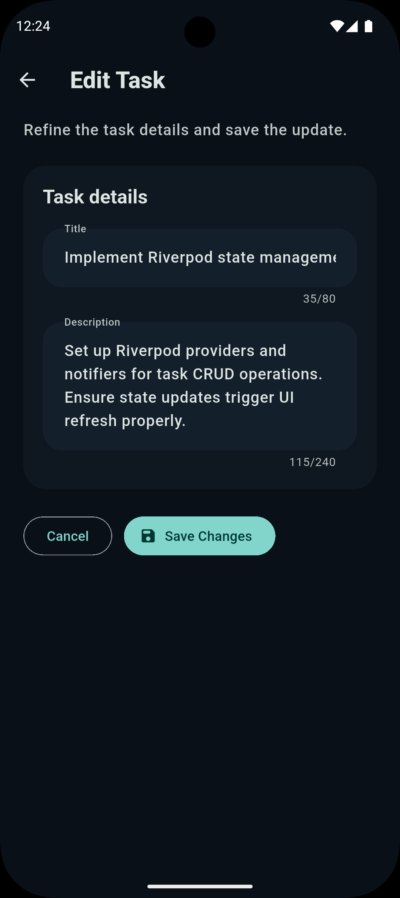

# Task Manager

A production-style Flutter personal task manager built with Clean Architecture, Riverpod, Hive, and Material 3. The app supports creating, editing, searching, completing, and deleting tasks while persisting data locally across sessions.

## Project Overview

This project demonstrates a scalable Flutter architecture suitable for real mobile applications. It focuses on:

- feature-first organization
- clear domain, data, and presentation boundaries
- local-first persistence with Hive
- state management with Riverpod
- responsive Material 3 UI with light and dark theme support

## Features

- View a persisted task list
- Create and edit tasks
- Mark tasks complete or incomplete
- Delete tasks with confirmation
- Search tasks by title
- Smooth loading and mutation feedback
- Empty states, error states, and polished form interactions
- System-driven dark mode

## Architecture

The app follows Clean Architecture with a feature-first structure.

### Layers

- `presentation`: screens, widgets, providers, and UI-facing state
- `domain`: entities, repository contracts, and use cases
- `data`: Hive models, local datasource implementation, and repository implementation
- `core`: shared routing, theme, and app-level constants

### Why this structure

- The domain layer stays independent from Flutter and Hive.
- The data layer handles persistence details and maps models to entities.
- The presentation layer consumes use cases through Riverpod providers instead of embedding business logic in widgets.
- The feature-first layout makes the codebase easier to scale as more features are added.

## Folder Structure

```text
lib/
|-- app.dart
|-- main.dart
|-- core/
|   |-- constants/
|   |-- router/
|   `-- theme/
`-- features/
	`-- tasks/
		|-- data/
		|   |-- datasource/
		|   |-- models/
		|   `-- repositories/
		|-- domain/
		|   |-- entities/
		|   |-- repositories/
		|   `-- usecases/
		`-- presentation/
			|-- providers/
			|-- screens/
			`-- widgets/
```

## Dependencies

### Runtime

- `flutter_riverpod`
- `hive`
- `hive_flutter`
- `go_router`
- `uuid`
- `freezed_annotation`

### Development

- `build_runner`
- `freezed`
- `hive_generator`
- `flutter_lints`

## Setup Instructions

### Prerequisites

- Flutter SDK installed
- Android Studio or VS Code with Flutter tooling
- An Android emulator or physical device

### Install and Run

```bash
flutter pub get
flutter run
```

### Verify Code Quality

```bash
flutter analyze
flutter test
```

## Local Storage

Tasks are stored locally using Hive. The task box is opened during app startup, and task data remains available between sessions on the same device or emulator.

## Screenshots

<div align="center">
  &nbsp;&nbsp;
  &nbsp;&nbsp;
  
</div>

<div align="center">
  &nbsp;&nbsp;
  &nbsp;&nbsp;
  
</div>

## APK Instructions

Build a release APK with:

```bash
flutter build apk --release
```

The generated APK will be available at:

```text
build/app/outputs/flutter-apk/app-release.apk
```

For split APKs by ABI:

```bash
flutter build apk --release --split-per-abi
```

## Future Improvements

- task categories and priorities
- due dates and reminders
- task sorting and filters
- cloud sync and backup

## Tech Summary

- Flutter
- Riverpod
- Hive
- GoRouter
- Material 3
- Clean Architecture
